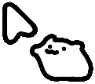
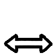

# Cat Cursor for macOS

> b站上刷到这个光标发现没有mac的安装渠道，一怒之下搞了个mac版的（
>
> 由于MAC本身的限制，切换app的时候有概率会显示原版光标，但是延迟实测不影响使用。
>
> Windows 原版光标由 b 站 [HappyCadogt](https://space.bilibili.com/406949928) 制作！！！😺
> 本项目基于其 V1.5 移植。Windows 原版下载：
> https://happycadogt.lanzoul.com/b01881lrdg 密码：`1145`
> 顺便这个链接里的文档我发现也有linux版本的
>
> 顺便这个的美术严格来讲属于b站的 [EverydayOneCat](https://b23.tv/36WQ9xd)。
> 大家也多多支持cat老师，ta有很多可爱猫动画🥺

---

## 长这样

| 什么时候 | 长这样 | | 什么时候 | 长这样 |
|---|:---:|---|---|:---:|
| 平时（会动） |  | | 左右拉伸（会动） |  |
| 点击 / 链接上 （会动）|  | | 上下拉伸 （动）|  |
| 文本框上（动） |  | | 斜角拉伸 |   |
| 精确定位 |  | | 拖动 |  |
| 禁用 |  | | | |


---

## 下载

去 [Releases](https://github.com/neco0w0/CatCursor/releases/latest) 下个压缩包，解压出来的CatCursor.app双击就能开。

第一次打开大概率会说"无法验证开发者"或者"已损坏"，因为我没买苹果那个开发者证书（
- 终端里跑一句 `xattr -cr ~/Downloads/CatCursor.app`（路径换成你自己解压的位置），然后再打开
- 或者系统设置→隐私与安全性→拉到最下面，会看到提示，点"仍要打开"

---

## 使用

打开之后不会有窗口也没有Dock图标，有个鼠标图案在菜单栏上，所有开关都在那里面，大小、点击时的猫爪动画、开机自启这些都能关。

如果发现光标形状不跟着变，比如鼠标移到文本框上还是那只普通猫，点菜单里的Calibrate for This Mac，它会接管你鼠标20秒左右学习你系统的光标长啥样，学完就正常了。做一次就行，以后系统大更新、或者在系统里改过鼠标设置之后，需要再点一次。

顺便说下为什么要这步：苹果每个大版本都会重画系统光标，我预置的数据是在macOS 26上采的，别的版本（比如Sonoma）对不上就认不出来就会出错。你在系统设置里调过指针大小也一样，光标尺寸变了就对不上了。

不想用了菜单里Quit一下，指针立马变回来。万一崩了系统也会自己把指针放出来，不会卡在没鼠标动不了的情况（应该

---

An animated cat pointer for macOS, ported (without asking, but with love) from
the Windows cursor pack **《普通的鼠标指针》V1.5** by **HappyCadogt**.

It idles with a little animation loop, waves a paw when you click, and changes
shape along with whatever your cursor is doing — typing, resizing a window,
dragging a divider. macOS gives you no way to swap out system cursors, so the
app hides the real one and draws a cat on top instead. No permissions needed.

---

## Credits

None of the art here is mine — two other people made everything you can see.

- **The cursor pack** — [HappyCadogt](https://space.bilibili.com/406949928)
  built the Windows original this is ported from (**V1.5**).
  Download: https://happycadogt.lanzoul.com/b01881lrdg — password `1145`
- **The cat** — the character belongs to
  [EverydayOneCat](https://b23.tv/36WQ9xd).

The pack is **free**; if someone charged you for it, ask for a refund. Free to
use and remix, **non-commercial only**, credit the author — same goes for this
repo. If you like the cursors, go follow them.

---

## The menu

The cat in your menu bar is the entire interface.

| | |
|---|---|
| **Cat Cursor Enabled** | turn it on or off without quitting |
| **Size** | Small / Medium / Large |
| **Follow Cursor Shape** | change with the system cursor, or stay the idle cat |
| **Paw Animation on Click** | the mouse-down reaction |
| **Launch at Login** | |
| **Calibrate for This Mac…** | if shape-matching isn't working |
| **Quit Cat Cursor** | puts your normal pointer back |

**If anything goes wrong, just quit and your pointer comes back.** Even on a
crash macOS restores it within a second — you can't get stuck without one.

---

## Good to know

- The cat trails your real mouse by a hair. Usually invisible; you might catch
  it on a fast flick.
- The real cursor can flash for an instant when you switch apps.
- Login screen and password prompts always use the system cursor.
- Drag-copy, drag-link and the "poof" cursor are left alone on purpose — their
  badges mean something (*copy*, or *this vanishes if you let go*) and a cat
  would throw that away. Anything else it doesn't recognise is left alone too.
- Shape-matching needs one pass of **Calibrate for This Mac…** on macOS versions
  other than 26, or if you've resized your system pointer. ~20 seconds, once.
- The static cursors are a touch soft — they only existed small in the original
  pack and got scaled up to match the animated ones.

---

## Something not turning into a cat?

Open an issue saying **exactly what you were doing** — which app, and what you
hovered over or dragged. There are more cursor shapes floating around than
you'd expect, and that's usually enough to track one down and add it.

---

## Building it yourself

Needs macOS 14+ and Xcode command line tools.

```bash
./Scripts/build_app.sh && open build/CatCursor.app
```

---

## Licence

The artwork isn't mine to license — it's HappyCadogt's, and the cat is
EverydayOneCat's, included here under their terms: free, non-commercial, credit
the author. The code is free to use in the same spirit.
